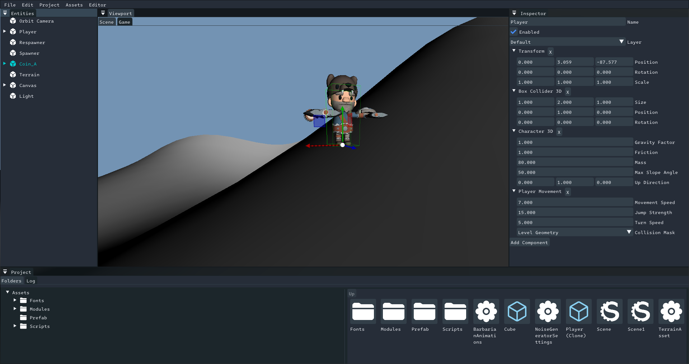

[](https://github.com/staple-engine/stapleengine/releases) 
[](https://github.com/staple-engine/stapleengine/blob/main/LICENSE) 
[](https://github.com/staple-engine/stapleengine/issues) 
[](https://github.com/staple-engine/stapleengine/stargazers) 



# Status

Early state, usable for small demos

# Features

| Name | Description|
|------|------------|
| Platforms | <ul><li>Windows</li><li>Linux</li><li>MacOS (partial)</li><li>Android</li></ul>
| Editor | <ul><li>Editor app that handles project management, asset editing, and building games</li><li>Extend the editor through game code</li></ul> |
| Entity System | <ul><li>Component + System</li><li>Also supports MonoBehaviour-style</li></ul> |
| Assets | <ul><li>Custom asset system easily defined in code</li><li>Asset pipeline baker tool that imports resources into engine-ready formats</li></ul>|
| Graphics | <ul><li>Forward rendering using BGFX</li><li>Custom shader format with support for variants</li><li>Shaders and Compute Shaders</li><li>Material system with support for toggling variants based on parameters being set</li><li>Culling Volumes for culling parts of the world efficiently</li></ul> |
| Input | <ul><li>Keyboard, Mouse, Touch, Gamepad support</li><li>Input Actions</li></ul> |
| Physics | <ul><li>Jolt Physics</li></ul> |
| Audio | <ul><li>Supports loading OGG, MP3, and WAV audio formats</li><li>OpenAL-based playback</li><li>Supports optional recompression for WAV assets</li></ul> |
| Meshes | <ul><li>Supports loading GLTF/GLB, FBX, and OBJ</li><li>Skeletal animation/skinning</li><li>Instancing</li><li>Mesh Simplification</li></ul> |
| Text Rendering | <ul><li>Using FreeType with optional gradients and outlines</li></ul> |
| Packages | <ul><li>Builtin, git, and local disk packages</li><li>Package manager within the editor</li></ul> |
| Assemblies and Plugins | <ul><li>Supports assembly definition assets and plugins</li></ul> |

# Installation

You can grab binaries from the releases page. You also need the [.NET 10 SDK](https://dotnet.microsoft.com/en-us/download/dotnet/10.0).

Please note that binaries aren't as updated as the main branch, so you'll likely want to build either way.

# Building

You need [premake](https://premake.github.io/) to generate some project files, as well as the [.NET 10 SDK](https://dotnet.microsoft.com/en-us/download/dotnet/9.0).

<details>

<summary>Windows</summary>

You need visual studio 2022.

To compile dependencies, open the visual studio dev terminal, go to the `Dependencies` directory, and run `build_windows`.

After that, you will need to compile the engine, so go to `Engine` and run `build_windows.cmd`.

After building the engine, you must build the tools, so go to `Tools` and run `build_windows.cmd`.

After building the tools, go to the main folder of the repo and run `builddefaultresources.cmd` to prepare the default assets.

</details>

<details>

<summary>MacOS</summary>

You need xcode.

To compile dependencies, go to `Dependencies` and run `build_macos.sh`.

After that, you will need to compile the engine, so go to `Engine` and run `build_macos.sh` and then run `build_backends.sh`.

After that, you will need to compile the tools, so go to `Tools` and run `build_linux.sh` (yes, that's the right file).

After building the tools, go to the main folder of the repo and run `builddefaultresources.sh` to prepare the default assets. Do notice that we can't build windows direct3D shaders in macOS, so you'll be limited to OpenGL, Metal, and Vulkan there.

</details>

<details>

<summary>Linux</summary>

### Required Packages

#### Ubuntu

```bash
sudo apt install premake git build-essential libxi-dev libxinerama-dev libxrandr-dev libxcursor-dev libgl1-mesa-dev libx11-dev libgtk-3-dev cmake clang
```

##### To install .NET

```bash
wget https://dot.net/v1/dotnet-install.sh -O dotnet-install.sh
chmod +x ./dotnet-install.sh
./dotnet-install.sh --version 10.0.100-rc.1.25451.107
```

##### Don't forget to add to your shell

```bash
export DOTNET_ROOT=$HOME/.dotnet
export PATH=$PATH:$DOTNET_ROOT:$DOTNET_ROOT/tools
```

#### Arch

```bash
sudo pacman -S premake git base-devel libxi libxinerama libxcursor libx11 gtk3 cmake clang
```

##### To install .NET

```bash
wget https://dot.net/v1/dotnet-install.sh -O dotnet-install.sh
chmod +x ./dotnet-install.sh
./dotnet-install.sh --version 10.0.100-rc.1.25451.107
```

##### Don't forget to add to your shell

```bash
export DOTNET_ROOT=$HOME/.dotnet
export PATH=$PATH:$DOTNET_ROOT:$DOTNET_ROOT/tools
```

### Instructions (After required packages)

To compile dependencies, go to `Dependencies` and run `build_linux.sh`.

After that, you will need to compile the engine, so go to `Engine` and run `build_linux.sh` and then run `build_backends.sh`.

Optionally, run `make_linux_menu_entry.sh` which should add an entry on your DE's start menu in the Development category

After that, you will need to compile the tools, so go to `Tools` and run `build_linux.sh`.

After building the tools, go to the main folder of the repo and run `builddefaultresources.sh` to prepare the default assts. Do notice that we can't build windows direct3D shaders in linux, so you'll be limited to OpenGL, Metal, and Vulkan there.
</details>
